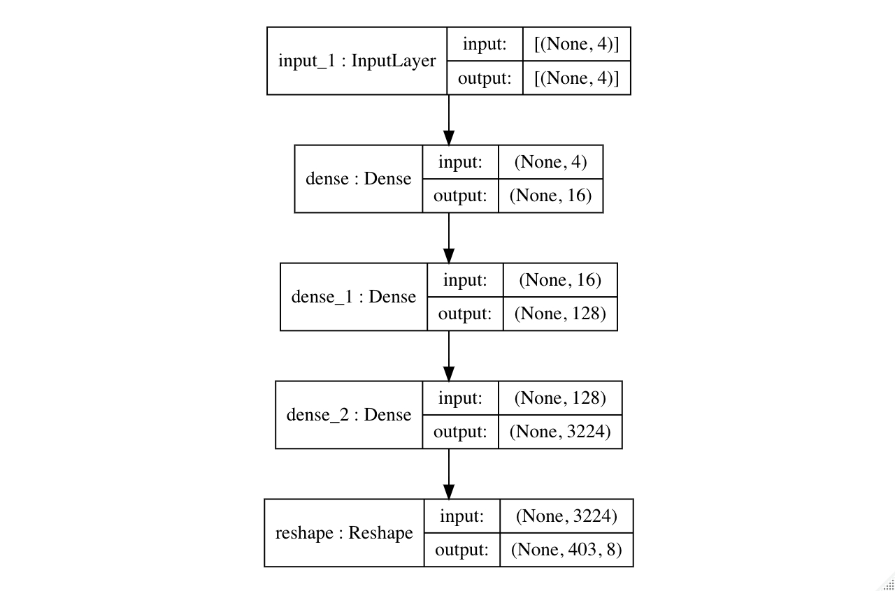
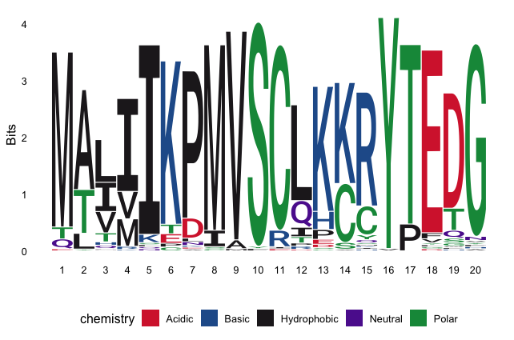
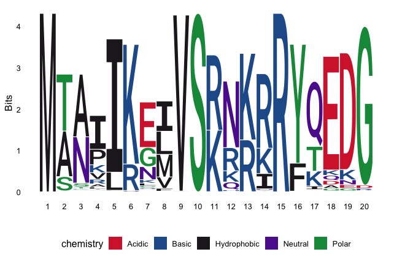
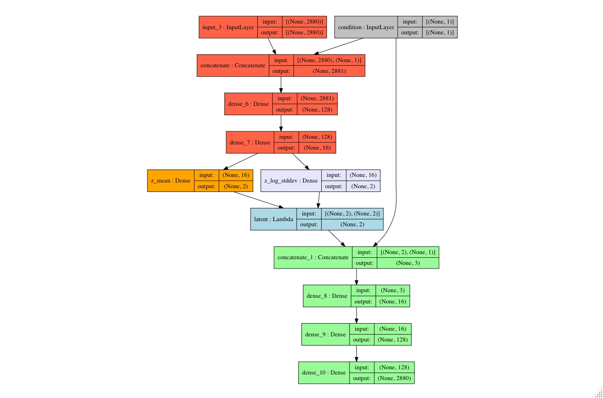
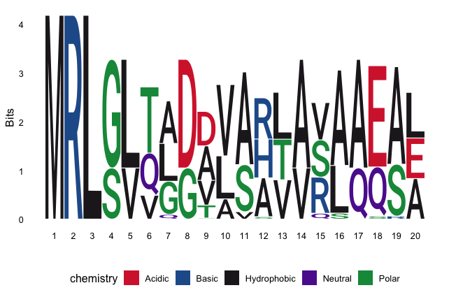
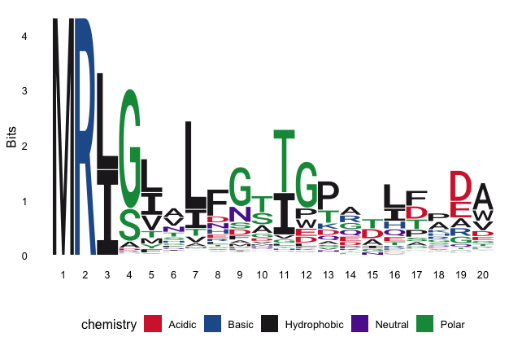
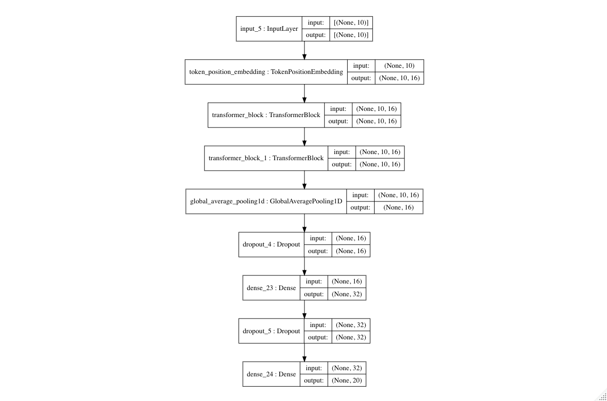

# GenProSeq

## Introduction

Generative modeling for protein engineering is key to solving fundamental problems in synthetic biology, medicine, and material science. Machine learning has enabled us to generate useful protein sequences on a variety of scales. Generative models are machine learning methods which seek to model the distribution underlying the data, allowing for the generation of novel samples with similar properties to those on which the model was trained. Generative models of proteins can learn biologically meaningful representations helpful for a variety of downstream tasks. Furthermore, they can learn to generate protein sequences that have not been observed before and to assign higher probability to protein sequences that satisfy desired criteria. In this package, common deep generative models for protein sequences, such as variational autoencoder (VAE), generative adversarial networks (GAN), and autoregressive models are available. In the VAE and GAN, the Word2vec is used for embedding. The transformer encoder is applied to protein sequences for the autoregressive model.

The first step in molecular machine learning is to convert the molecular data into a numerical format suitable for the machine learning models. As an example of a raw representation is the sparse or one-hot encoding. Here, each amino acid is encoded as a vector, where a bit is set according to an index using the known amino acids. The naive way of representing a word in vector form is one hot representation but it is a very ineffective way for representing a huge corpus. In a more effective way, we need some semantic similarities to nearby points, thus creating the representation bring beneficial information about the word actual meaning, called word embedding models. In natural language processing, often large, one-hot encoded vectors are transformed into smaller dimension vectors, by finding word relations based on proximity or positions of similar words using the contexts of nearby neighbors. The Word2vec is one of the most common word embedding models that gives low-dimensional dense vector (word embedding) of the term (words and phrases). The Word2vec has also been applied to amino acids as a basis for traditional machine learning methods.

The generative adversarial network (GAN) is able to mimic any distribution of data in any domain containing images, music, speech, and prose. The GAN is an example of a network that use unsupervised learning to train two models in parallel. The network is forced to efficiently represent the training data, making it more effective at generating data similar to the training data. The GAN is made up of a discriminator and a generator that compete in a two-player minimax game. The generator generates a simulated example given as its input from a specified distribution. The objective of the generator is to produce an output that is so close to real that it confuses the discriminator in being able to differentiate the fake data from the real data. Both the generated examples and authentic ones are fed to the discriminator network, whose job is to distinguish between the fake and the real data. Generative adversarial nets can be extended to a conditional model if both the generator and discriminator are conditioned on some extra information, such as class labels or data from other views. The conditional GAN (CGAN) is based on vanilla GAN with additional conditional input to generator and discriminator. This extracts features based on the modelling of the conditional input. The auxiliary classifier GAN (ACGAN) is an extension of CGAN that adds conditional input only to the generator.

The autoencoder is the unsupervised neural network approach to learn how to encode data efficiently in a latent space. In the autoencoder, an encoder maps data from the input space to the latent space and a decoder is used to reconstruct the input data from the encoded latent data. The variational autoencoder (VAE) is a class of autoencoder where the encoder module is used to learn the parameter of a distribution and the decoder is used to generate examples from samples drawn from the learned distribution. The VAE does not allow us to constrain the generated sample to have a particular characteristic, but one may want to draw samples with the desired feature. A question then arises on how to endow the model to create targeted samples rather than completely random ones. The conditional variational autoencoder (CAVE) is designed to generate desired samples by including additional conditioning information.

Language models learn the syntactic order of a language from a given set of examples as probability values to predict a sequence of words. A language model is an indispensable ingredient in many advanced natural language processing (NLP) tasks such as text summarization, machine translation, and language generation. The language modeling is a typical self-supervised objective, for it does not require any labels. Language models developed for NLP tasks have evolved from statistical language models to neural language models. Approaches such as n-gram and hidden Markov models have become the primary ingredient in developing statistical language models. In contrast, various deep learning neural networks build neural language models. In the autoregressive (AR) language modeling, models are tasked with generating subsequent tokens based on previously generated tokens. Thus the autoregressive generative model predicts the next amino acid in a protein given the amino acid sequence up to that point. The autoregressive model generates proteins one amino acid at a time. For one step of generation, it takes a context sequence of amino acids as input and outputs a probability distribution over amino acids. We sample from that distribution and then update the context sequence with the sampled amino acid. This process repeats until a protein of desired length has been generated.

The Transformer architecture demonstrates impressive text generation capabilities. This perspective is adapted to protein engineering by training the autoregressive language model with the Transformer encoder on amino acid sequences. Compared to conventional sequential models such as RNN, the Transformer is a new architecture that is more effective in modeling long-term dependence in temporal sequences, where all tokens will be equally considered during the attention operation. And it is more efficient in training while eliminating sequential dependencies from previous tokens. The Transformer models can generally overcome the inherent limitations of classic neural network architectures. For example, these models overcome the problem of speed inherent in RNN, LSTM, or GRU, which require sequential operations that are slow in nature. They can also overcome the long-term dependencies problem of CNN, which can never accurately handle long-range dependences in the text corpus. Unlike RNN, the Transformer cannot consider the order of the input data, by using not only tokens but also positions for embedding. Since the Transformer has a very powerful ability to model sequential data, it becomes the most popular backbone of NLP applications. The Transformer architecture is a nonrecurrent architecture with a series of attention-based blocks. Each block is composed of a multi-head attention layer and a position-wise feedforward layer with an add and normalize layer in between. These layers process input sequences simultaneously, in parallel, independently of sequential order.


## Installation

Fro this package, it is required to install tensorflow and kears in Python and connect to R (https://tensorflow.rstudio.com, https://keras.rstudio.com).
To install the development version from GitHub:
``` 
devtools::install_github("dongminjung/GenProSeq")
```


## Example

## GAN

The sequences of the PTEN are used to train the GAN. The input sequences must be aligned to have the same length. To train the model, we can use the function "fit_GAN" with aligned sequence data. To generate sequences, we can use the function "gen_GAN" with the trained model.
It is expected that the model can rapidly generate highly diverse novel functional proteins within the allowed biological constraints of the sequence space. Note that the same dataset is used for training and validation here.
```
library(GenProSeq)

# model parameters
length_seq <- 403
embedding_dim <- 8
latent_dim <- 4
epochs <- 20
batch_size <- 64

# GAN
GAN_result <- fit_GAN(prot_seq = example_PTEN,
                      length_seq = length_seq,
                      embedding_dim = embedding_dim,
                      latent_dim = latent_dim,
                      intermediate_generator_layers = list(
                          layer_dense(units = 16),
                          layer_dense(units = 128)),
                      intermediate_discriminator_layers = list(
                          layer_dense(units = 128, activation = "relu"),
                          layer_dense(units = 16, activation = "relu")),
                      prot_seq_val = example_PTEN,
                      epochs = epochs,
                      batch_size = batch_size)
```

The model architecture of the generator is shown below.
```
ttgsea::plot_model(GAN_result$generator)
```



The model architecture of the discriminator is shown below.
```
ttgsea::plot_model(GAN_result$discriminator)
```


In a graphical manner, a sequence logo shows the probability of occurrence for each symbol at specific positions. Thus, the height of a symbol indicates the relative frequency of the symbol at that position. The sequence logo of the first 20 amino acids of the generated protein sequences is shown below.
```
set.seed(1)
gen_prot_GAN <- gen_GAN(GAN_result, num_seq = 100)
ggseqlogo::ggseqlogo(substr(gen_prot_GAN$gen_seq, 1, 20))
```



The sequence logo of the first 20 amino acids of the real protein sequences is shown below. Here, it is assumed that the conserved position is the first amino acid. The sequence logo is a visualization approach to graphically represent the sequence conservation.
```
ggseqlogo::ggseqlogo(substr(example_PTEN, 1, 20))
```




## VAE

Consider the aligned sequences of the luxA for traing the CVAE with labels. Suppose that the label is the third amino acid of each sequence. Thus there are two class labels. Using the function "fit_VAE", we build an encoder model that takes a protein sequence and projects it on the latent space and a decoder model that goes from the latent space back to the amino acid representation. And then, the function "gen_VAE" generates sequences with the desired labels. Note that the same dataset is used for training and validation.
```
library(GenProSeq)
label <- substr(example_luxA, 3, 3)

# model parameters
length_seq <- 360
embedding_dim <- 8
batch_size <- 128
epochs <- 20

# CVAE
VAE_result <- fit_VAE(prot_seq = example_luxA,
                    label = label,
                    length_seq = length_seq,
                    embedding_dim = embedding_dim,
                    embedding_args = list(iter = 20),
                    intermediate_encoder_layers = list(layer_dense(units = 128),
                                                        layer_dense(units = 16)),
                    intermediate_decoder_layers = list(layer_dense(units = 16),
                                                        layer_dense(units = 128)),
                    prot_seq_val = example_luxA,
                    label_val = label,
                    epochs = epochs,
                    batch_size = batch_size,
                    use_generator = FALSE,
                    optimizer = keras::optimizer_adam(clipnorm = 0.1),
                    callbacks = keras::callback_early_stopping(
                        monitor = "val_loss",
                        patience = 10,
                        restore_best_weights = TRUE))
```

The plot for model architecture of the CVAE is drawn below.
```
VAExprs::plot_vae(VAE_result$model)
```



The sequence logo of the first 20 amino acids of the generated protein sequences with the label "I" is shown below.
```
set.seed(1)
gen_prot_VAE <- gen_VAE(VAE_result, label = rep("I", 100), num_seq = 100)
ggseqlogo::ggseqlogo(substr(gen_prot_VAE$gen_seq, 1, 20))
```


The sequence logo of the first 20 amino acids of the generated protein sequences with the label "L" is shown below.
```
gen_prot_VAE <- gen_VAE(VAE_result, label = rep("L", 100), num_seq = 100)
ggseqlogo::ggseqlogo(substr(gen_prot_VAE$gen_seq, 1, 20))
```



The sequence logo of the first 20 amino acids of the real protein sequences is shown below.
```
ggseqlogo::ggseqlogo(substr(example_luxA, 1, 20))
```




## AR with Transformer

The SARS coronavirus 3C-like Protease is used to train the autoregressive language model with the Transformer. The same dataset is used for training and validation.
```
library(GenProSeq)
prot_seq <- DeepPINCS::SARS_CoV2_3CL_Protease

# model parameters
length_seq <- 10
embedding_dim <- 16
num_heads <- 2
ff_dim <- 16
num_transformer_blocks <- 2
batch_size <- 32
epochs <- 500

# ART
ART_result <- fit_ART(prot_seq = prot_seq,
                    length_seq = length_seq,
                    embedding_dim = embedding_dim,
                    num_heads = num_heads,
                    ff_dim = ff_dim,
                    num_transformer_blocks = num_transformer_blocks,
                    layers = list(layer_dropout(rate = 0.1),
                                layer_dense(units = 32, activation = "relu"),
                                layer_dropout(rate = 0.1)),
                    prot_seq_val = prot_seq,
                    epochs = epochs,
                    batch_size = batch_size,
                    use_generator = TRUE,
                    callbacks = callback_early_stopping(
                        monitor = "val_loss",
                        patience = 50,
                        restore_best_weights = TRUE))
```

The model architecture is shown below.
```
ttgsea::plot_model(ART_result$model)
```



The learned autoregressive model generates new sequences of proteins. After the language model generates a conditional probability distribution over vocabulary for the given input sequence, we need to decide how to choose the next word or token from the distribution. The greedy search simply selects the token with the highest probability value as its next token. Rather than just considering the highest probable word, the top b words is taken as the next word in the beam search. Here b is also called the beam size which is itself a parameter. Now to compute the second word each of these b first words is fed and top b words are obtained again. The process continues till the end. In temperature sampling, we sample the token from the modified conditional probability distribution over the vocabulary for the given temperature value. In the top-k sampling, the k most likely next tokens are filtered and their probabilities are adjusted among only those k tokens. In a similar manner, the top-p sampling is another way to exclude very low probability tokens and it finds the smallest set of tokens that have summed probability at least p.
```
seed_prot <- "SGFRKMAFPS"
gen_ART(ART_result, seed_prot, length_AA = 20, method = "greedy")
"SGFRKMAFPSGKVEGCMVQVTCGTTTLNGL"
substr(prot_seq, 1, 30)
"SGFRKMAFPSGKVEGCMVQVTCGTTTLNGL"
gen_ART(ART_result, seed_prot, length_AA = 20, method = "beam", b = 5)
"SGFRKMAFPSGKVEGCMVQVTCGTTTLNGL"
substr(prot_seq, 1, 30)
"SGFRKMAFPSGKVEGCMVQVTCGTTTLNGL"
gen_ART(ART_result, seed_prot, length_AA = 20, method = "temperature", t = 0.1)
"SGFRKMAFPSGKVEGCMVQVTCGTTTLNGL"
substr(prot_seq, 1, 30)
"SGFRKMAFPSGKVEGCMVQVTCGTTTLNGL"
gen_ART(ART_result, seed_prot, length_AA = 20, method = "top_k", k = 3)
"SGFRKMAFPSGKVEGCMVQVTCGTTTLNGL"
substr(prot_seq, 1, 30)
"SGFRKMAFPSGKVEGCMVQVTCGTTTLNGL"
gen_ART(ART_result, seed_prot, length_AA = 20, method = "top_p", p = 0.75)
"SGFRKMAFPSGVVELDMVPMVRVVVRHVHV"
substr(prot_seq, 1, 30)
"SGFRKMAFPSGKVEGCMVQVTCGTTTLNGL"
```

We can compute pairwise similarities between the real and generated protein sequences. The function "stringsim" vary between 0 for strings that are not similar at all, to 1 for strings that are identical. One advantage of the string similarity over the string distance function is that similarities are easier to interpret because they are normalized.
```
stringdist::stringsim(gen_ART(ART_result, seed_prot, length_AA = 20, method = "greedy"),
                    substr(prot_seq, 1, 30))
1
stringdist::stringsim(gen_ART(ART_result, seed_prot, length_AA = 30, method = "greedy"),
                    substr(prot_seq, 1, 40))
1
stringdist::stringsim(gen_ART(ART_result, seed_prot, length_AA = 40, method = "greedy"),
                    substr(prot_seq, 1, 50))
1
stringdist::stringsim(gen_ART(ART_result, seed_prot, length_AA = 50, method = "greedy"),
                    substr(prot_seq, 1, 60))
1
```


# References

Barbosa, V. A. F., Santana, M. A., Andrade, M. K. S., Lima, R. C. F., & Santos, W. P. (2020). Deep Learning for Data Analytics: Foundations, Biomedical Applications, and Challenges. Academic Press.

Cinelli, L. P., Marins, M. A., da Silva, E. A. B., & Netto, S. L. (2021). Variational Methods for Machine Learning with Applications to Deep Networks. Springer.

Dash, S., Acharya, B. R., Mittal, M., Abraham, A., & Kelemen, A. (Eds.). (2020). Deep learning techniques for biomedical and health informatics. Springer.

Deepak, P., Chakraborty, T., & Long, C. (2021). Data Science for Fake News: Surveys and Perspectives. Springer.

Dong, G., & Pei, J. (2007). Sequence data mining. Springer.

Frazer, J., Notin, P., Dias, M., Gomez, A., Brock, K., Gal, Y., & Marks, D. (2020). Large-scale clinical interpretation of genetic variants using evolutionary data and deep learning. bioRxiv.

Gagniuc, P. A. (2021). Algorithms in Bioinformatics: Theory and Implementation. Wiley & Sons.

Hawkins-Hooker, A., Depardieu, F., Baur, S., Couairon, G., Chen, A., & Bikard, D. (2020). Generating functional protein variants with variational autoencoders. bioRxiv.

Hemanth, J., Bhatia, M., & Geman, O. (2020). Data Visualization and Knowledge Engineering: Spotting Data Points with Artificial Intelligence. Springer.

Lappin, S. (2021). Deep learning and linguistic representation. CRC Press.

Liebowitz, J. (Ed.). (2020). Data Analytics and AI. CRC Press.

Liu, Z., Lin, Y., & Sun, M. (2020). Representation learning for natural language processing. Springer.

Madani, A., McCann, B., Naik, N., Keskar, N. S., Anand, N., Eguchi, R. R., Huang, P., & Socher, R. (2020). Progen: Language modeling for protein generation. arXiv:2004.03497.

Pearson, R. K. (2018). Exploratory data analysis using R. CRC Press.

Pedrycz, W., & Chen, S. M. (Eds.). (2020). Deep Learning: Concepts and Architectures. Springer.

Peter, J. D., Fernandes, S. L., Thomaz, C. E., & Viriri, S. (Eds.). (2019). Computer aided intervention and diagnostics in clinical and medical images. Springer.

Repecka, D., et al. (2019). Expanding functional protein sequence space using generative adversarial networks. bioRxiv.

Suguna, S. K., Dhivya, M., & Paiva, S. (Eds.). (2021). Artificial Intelligence (AI): Recent Trends and Applications. CRC Press.

Sun, S., Mao, L., Dong, Z., & Wu, L. (2019). Multiview machine learning. Springer.

Wolkenhauer, O. (2020). Systems Medicine: Integrative, Qualitative and Computational Approaches. Academic Press.

Wu, Z., Johnston, K. E., Arnold, F. H., & Yang, K. K. (2021). Protein sequence design with deep generative models. arXiv:2104.04457.
